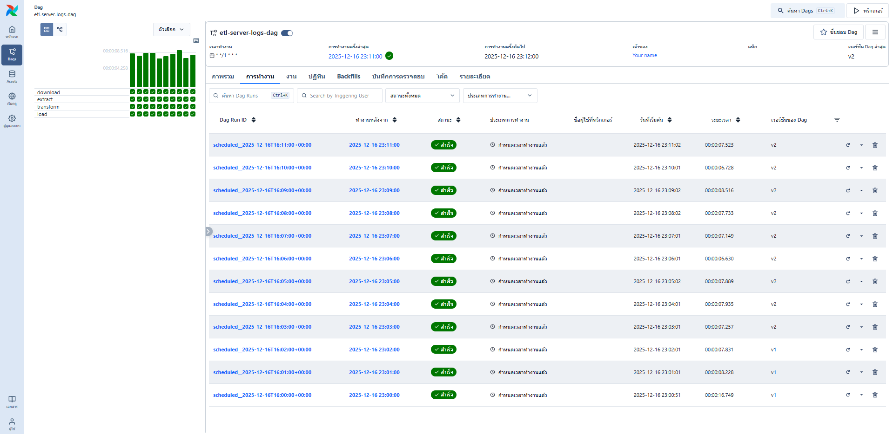
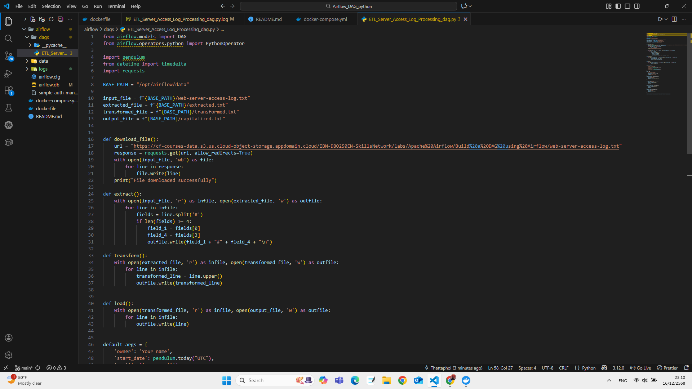

## Create a DAG for Apache Airflow with PythonOperator

In this lab, you will explore the Apache Airflow web user interface (UI). You will then create a Direct Acyclic Graph (DAG) using PythonOperator and finally run it through the Airflow web UI.

